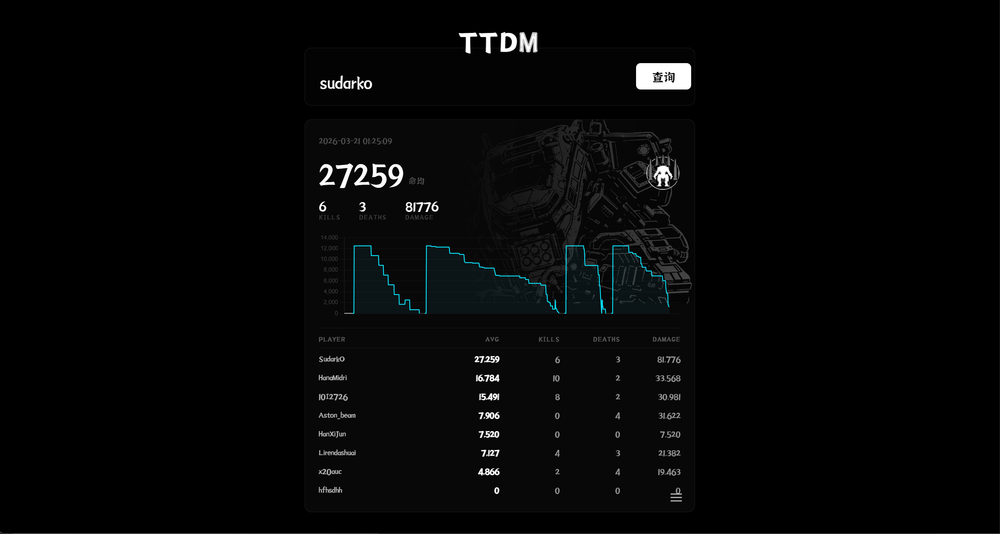

# TTDMRecorder

自动记录 Titan Team Deathmatch (TTDM) 对局数据并上传至 [ttdm-review](https://ttdm-review.pages.dev) 的 Northstar 客户端 Mod。

Automatically records Titan Team Deathmatch (TTDM) match data and uploads it to [ttdm-review](https://ttdm-review.pages.dev). A client-side Northstar mod.

---

- 本项目为公益项目，介于部分用户 （例如 绘之音..） 恶意填塞脏数据，短时间内过分请求，导致资源紧张，网站瘫痪，故不再公开API接口

- This project is a totally non-profit project. Due to some users (such as 绘之音..) maliciously filling in dirty data, excessive requests in a short period of time, causing resource shortage and the website to crash, the API interface will no longer be publicly available.

## 功能 / Features

- 自动检测 TTDM 模式，进入对局后开始录制
- 每 500ms 采样一次玩家血量和泰坦类型，生成 timeline CSV
- 对局结束时收集所有玩家的击杀、死亡、伤害数据，生成 players CSV
- 对局结束后自动上传两份 CSV 至远程服务器，上传成功后删除本地文件
- 上传失败自动重试，最多 5 次
- 启动时自动扫描上次未上传成功的残留文件并补传，残缺文件自动清理
- HUD 通知上传结果

---

- Automatically detects TTDM game mode and starts recording on match start
- Samples player health and titan type every 500ms into a timeline CSV
- Collects all players' kills, deaths, and damage at match end into a players CSV
- Auto-uploads both CSVs to the remote server after match ends; deletes local files on success
- Auto-retries on upload failure, up to 5 attempts
- On startup, scans for leftover files from previous failed uploads and re-uploads them; orphaned files are cleaned up
- HUD notification for upload results

## 安装 / Installation

1. 确保已安装 [`Northstar`](https://northstar.tf) 客户端 | 该Mod已针对 `NorthstarCN` 完成适配
2. 将 `TTDMRecorder` 文件夹放入 `R2Northstar/mods/` 目录
3. 启动游戏，加入 TTDM 模式即可自动工作

---

1. Make sure you have the [Northstar](https://northstar.tf) client installed | This mod has adapted to `NorthstarCN`
2. Place the `BeijiFox.TTDMRecorder` folder into `R2Northstar/mods/`
3. Launch the game and join a TTDM match — the mod works automatically

## 数据文件 / Data Files

对局数据保存在 `R2Northstar/save_data/` 目录下，文件名格式：

Match data is saved under `R2Northstar/save_data/`, filename format:

## 依赖 / Requirements

- [Northstar](https://northstar.tf) v1.9.0+
- 游戏模式：TTDM / Game mode: TTDM

## 许可 / License

MIT
