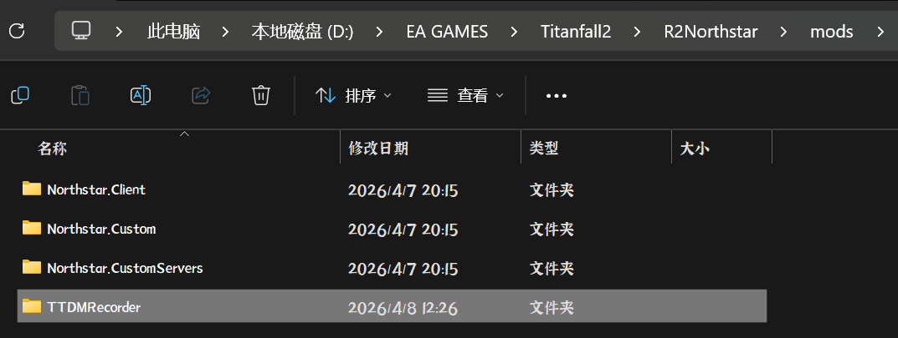

# TTDMRecorder | 泰坦争斗记录器
# 官网 | Official Website ： [ttdm.space](https://ttdm.space)

##  模组现已适配`官服`和`NSCN` ！

 模组会在每局TTDM[泰坦争斗]中设置1200个采样点，记录你的`生命值`，`泰坦种类`，`击杀数`，`伤害输出`并加密上传至 [ttdm-review](https://ttdm-review.pages.dev) / [ttdm.space](https://ttdm.space)，你可以直接在这个网站复盘每一场游戏。 并且游戏会一同上传其他玩家的数据，所以欢迎你安装此Mod来丰富TTDM的复盘数据。

This mod will set 1200 sampling points in each TTDM match to record your `health`, `TitanType`,`kills`, and `DeltaDamage`, and encrypt and upload it to [ttdm-review](https://ttdm-review.pages.dev) or [ttdm.space](https://ttdm.space), where you can replay each game directly on this website. And the game will also upload other players' data, so welcome you to install this mod to enrich the replay data of TTDM.

- 本项目为公益项目，数据不会用于任何形式的商业用途，云端加密存储，请放心使用。

- This project is a totally non-profit project, the data will not be used for any commercial purposes, cloud storage encryption, please use it with confidence.
  
---

## 安装教程 / Installation

1. 确保已安装 [`ION Client`](https://thunderstore.io/c/northstar/p/r2ion/Ion/) 或 [`NorthstarCN`](https://northstar.cool) 客户端  | 模组已针对这两个北极星分支完成适配
2. 将 `TTDMRecorder` 解压后的`一整个`大文件夹 文件夹放入 `R2Northstar/mods/` 目录
3. 启动游戏，加入 TTDM 模式即可自动工作

---

1. Make sure you have installed [`ION Client`](https://thunderstore.io/c/northstar/p/r2ion/Ion/) or [`NorthstarCN`](https://northstar.cool) client  | The mod has been adapted for these two Northstar branches
2. Decompress the whole `TTDMRecorder` folder into `R2Northstar/mods/`
3. Launch the game and join a TTDM match - the mod works automatically

 这是安装完成后的样子 | This is how it looks after installation

---

## 联系方式 / Contact

### 出问题了？ 你有新的想法？ something wrong? you have new ideas?
- 你可以加入QQ群了解更多 或是和志同道合的朋友一起讨论 [点击链接加入群聊【TTDM】](https://qm.qq.com/q/5tXZkFBBRe)
- Or you can just email me at `2963502563@qq.com`.
  
---

## 功能 / Features

- 自动检测 TTDM 模式，进入对局后开始采样
- 每 500ms 采样一次玩家血量和泰坦类型，造成的伤害，生成 timeline
- 对局结束时收集所有玩家的击杀、死亡、伤害数据上传至远程服务器，上传成功后删除本地文件
- HUD 通知上传结果

---

- Automatically detects TTDM game mode and starts recording on match start
- Sample player health and Titan type, damage dealt, and generate timeline every 500ms
- Collect all players' kill, death, and damage data at the end of the game, upload it to the remote server, and delete the local file after successful upload
- HUD notification for upload results

## 依赖 / Requirements

- [`ION Client`](https://thunderstore.io/c/northstar/p/r2ion/Ion/) / [`NorthstarCN`](https://northstar.cool)
- 游戏模式：TTDM / Game mode: TTDM